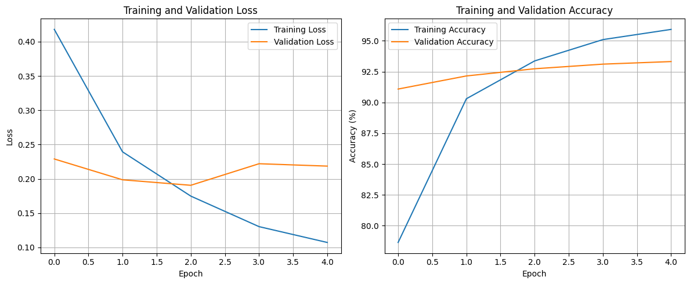
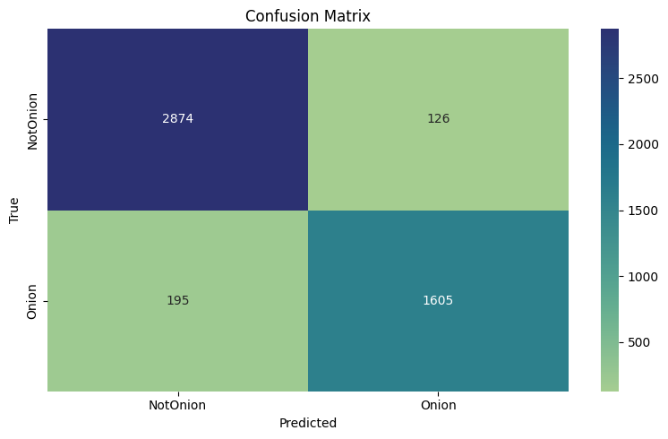

## Portfolio 2: Classification of the Onion Dataset

The task is to classify whether a given text is from an Onion article or not. The dataset is taken from [here](https://www.kaggle.com/datasets/chrisfilo/onion-or-not). The task was solved collaboratively by all three of us, and the best model was chosen.

### Data Cleaning

The text data is cleaned using the following steps:
- Convert to lowercase
- Trim whitespace
- Normalize spacing
- Remove URLs
- Convert contracted words (e.g., "can't") into their expanded forms (e.g., "cannot").

### Training the Model

The DeBERTa base model is used for training. The model was fine-tuned for 5 epochs with a learning rate of 2e-5 and a linear schedule. Random token dropout was implemented during training to avoid overfitting. The loss and accuracy plot is shown below:



The classification report is shown below:

```
Final Validation Accuracy: 93.31%

Final Classification Report:
              precision    recall  f1-score   support

    NotOnion       0.94      0.96      0.95      3000
       Onion       0.93      0.89      0.91      1800

    accuracy                           0.93      4800
   macro avg       0.93      0.92      0.93      4800
weighted avg       0.93      0.93      0.93      4800
```

The confusion matrix is shown below




Running inference on a new sample gave the correct prediction:

```
Running example inference...
Text: Man With Fogged-Up Glasses Forced To Finish Soup Using Other Senses
Prediction: Onion
Confidence: 87.76%

Probabilities:
NotOnion: 12.24%
Onion: 87.76%
```

The notebook for training and inference can be found [here](./OnionClassification.ipynb).