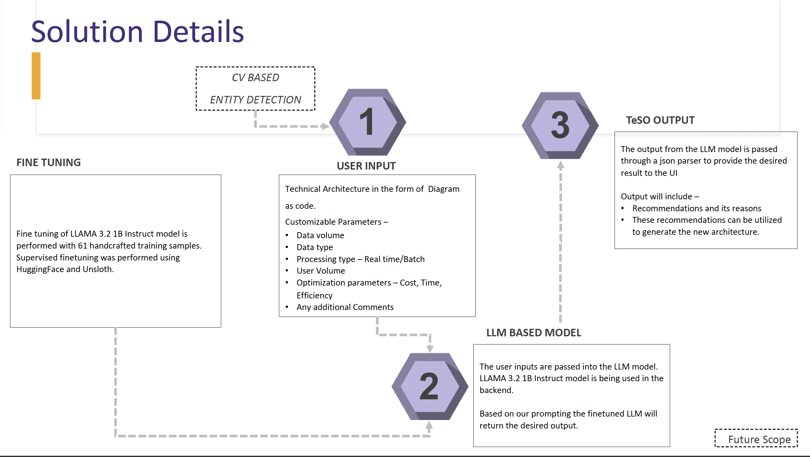
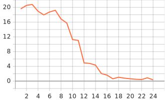
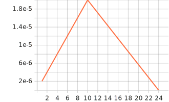
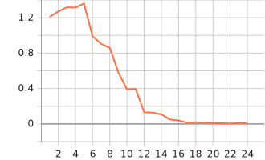

## TeSO - Tech Stack Optimizer

### Introduction
TeSO (Tech Stack Optimizer) is a Gen-AI-powered tool designed to analyze a project's current architecture and recommend an optimized tech stack. By leveraging a fine-tuned LLM model, TeSO provides intelligent recommendations that enhance system compatibility, scalability, and maintainability while also considering organizational constraints.

### How It Works


The user provides the technical architecture as a diagram (as code). The prompt can be customized to include additional information for optimization. The inputs are processed by a **fine-tuned LLaMA 3.2 1B Instruct model**. The model generates recommendations based with detailed explanations and reasons.

### Dataset
A synthetic dataset consisting of 61 training and 5 validation samples was created using ChatGPT and NotebookLM. The dataset consists of diagrams as code (using the `diagrams` Python package) as input, with improvement recommendations as output. System design references were uploaded to ChatGPT and NotebookLM to ensure that the generated output aligned with the book rather than providing general recommendations from an LLM. The diagram as code was collected from GitHub.

The dataset can be found [here](https://huggingface.co/datasets/gokul-pv/TeSo-Dataset)

### Training the Model

We fine-tuned the 4-bit version of the **LLaMA 3.2-1B Instruct** model using Hugging Face, the Unsloth library, and LoRA. The model was trained for 3 epochs with a learning rate of 2e-5 and a linear schedule. Unsloth’s `train_on_responses_only` was used to train only on assistant responses while ignoring the loss on user inputs. Finally, the model was saved in 16-bit precision. The trained model can be found [here](https://huggingface.co/gokul-pv/Llama-3.2-1B-Instruct-16bit-TeSO).


<table>
  <tr>
    <th>grad_norm</th>
    <th>learning_rate</th>
    <th>loss</th>
  </tr>
  <tr>
    <td></td>
    <td></td>
    <td></td>
  </tr>
</table>


The training notebook can be found [here](./unsloth-llama.ipynb).

### Evaluation Metrics

Several intrinsic evaluation metrics were computed:

- **Perplexity** - Measures how well the model predicts the next token in a sequence.
- **BLEU** (Bilingual Evaluation Understudy) - Measures the overlap between the generated text and the reference text using n-gram precision. 
- **ROUGE** (Recall-Oriented Understudy for Gisting Evaluation) - Measures recall (and F1) based on n-gram overlap between generated text and reference text.  
- **BERTScore** - Uses contextual embeddings (BERT) to compare the semantic similarity between the generated and reference texts. 

Each metric offers a different perspective on the model's performance.

```python
ID: 62, Perplexity: 7.1007
ID: 63, Perplexity: 12.7885
ID: 64, Perplexity: 11.0817
ID: 65, Perplexity: 3.9705
ID: 66, Perplexity: 4.7665

Average Perplexity: 7.9416 (Range: 0 to infinity, lower is better)

Average BLEU Score: 0.0040 (Range: 0 to 1, higher is better)
Average ROUGE-1 F1 Score: 0.1536 (Range: 0 to 1, higher is better)
Average ROUGE-L F1 Score: 0.1025 (Range: 0 to 1, higher is better)
Average BERTScore F1: 0.4911 (Range: 0 to 1, higher is better)
```

### Demo
Check out the live demo of TeSO on Hugging Face Spaces:  
[TeSO Demo](https://huggingface.co/spaces/gokul-pv/TeSo)

As the app is running on a CPU in Hugging Face Spaces, the response time may be slow. You can run the app locally by cloning the repository and executing `gradio app.py` for CPU inference or `gradio inference.py` for GPU inference.

The PDF of the presentation can be found [here](./TeSo_PPT.pdf).

---

Let TeSO guide you to the best technology stack for your next project!
